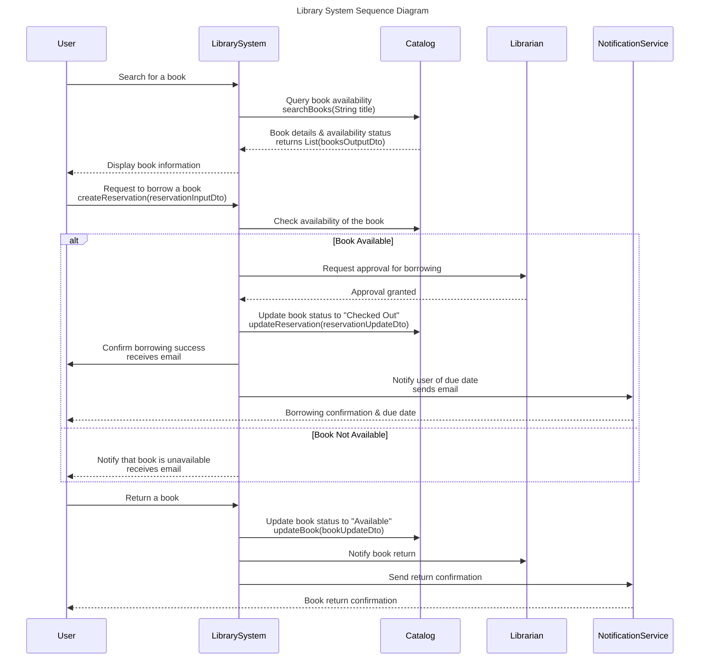

```mermaid
sequenceDiagram
title Library System Sequence Diagram

    participant User
    participant LibrarySystem
    participant Catalog
    participant Librarian
    participant NotificationService
    
    User->>LibrarySystem: Search for a book
    LibrarySystem->>Catalog: Query book availability <br> searchBooks(String title)
    Catalog-->>LibrarySystem: Book details & availability status <br> returns List(booksOutputDto)
    LibrarySystem-->>User: Display book information
    
    User->>LibrarySystem: Request to borrow a book <br> createReservation(reservationInputDto)
    LibrarySystem->>Catalog: Check availability of the book
    alt Book Available
        LibrarySystem->>Librarian: Request approval for borrowing
        Librarian-->>LibrarySystem: Approval granted
        LibrarySystem->>Catalog: Update book status to "Checked Out" <br> updateReservation(reservationUpdateDto)
        LibrarySystem->>User: Confirm borrowing success <br> receives email
        LibrarySystem->>NotificationService: Notify user of due date <br>sends email
        NotificationService-->>User: Borrowing confirmation & due date
    else Book Not Available
        LibrarySystem-->>User: Notify that book is unavailable <br> receives email
    end
    
    User->>LibrarySystem: Return a book
    LibrarySystem->>Catalog: Update book status to "Available" <br> updateBook(bookUpdateDto)
    LibrarySystem->>Librarian: Notify book return
    LibrarySystem->>NotificationService: Send return confirmation
    NotificationService-->>User: Book return confirmation
```