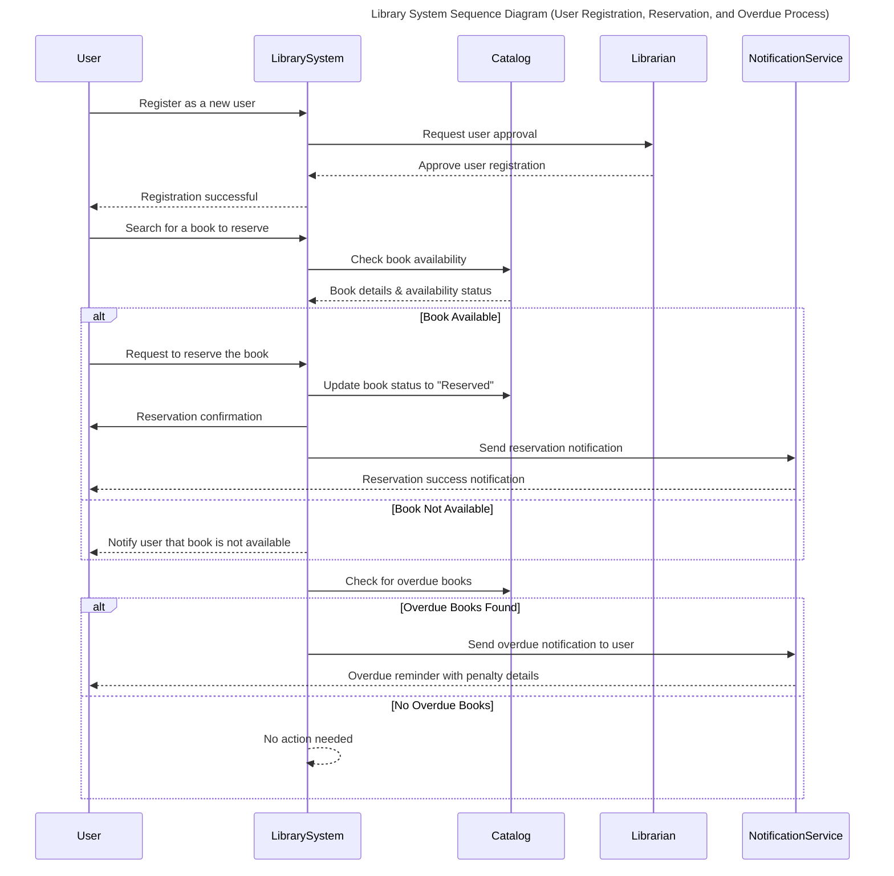

```mermaid
sequenceDiagram
title Library System Sequence Diagram (User Registration, Reservation, and Overdue Process)

    participant User
    participant LibrarySystem
    participant Catalog
    participant Librarian
    participant NotificationService
    
    %% 1. User Registration
    User->>LibrarySystem: Register as a new user
    LibrarySystem->>Librarian: Request user approval
    Librarian-->>LibrarySystem: Approve user registration
    LibrarySystem-->>User: Registration successful
    
    %% 2. Book Reservation
    User->>LibrarySystem: Search for a book to reserve
    LibrarySystem->>Catalog: Check book availability
    Catalog-->>LibrarySystem: Book details & availability status
    alt Book Available
        User->>LibrarySystem: Request to reserve the book
        LibrarySystem->>Catalog: Update book status to "Reserved"
        LibrarySystem->>User: Reservation confirmation
        LibrarySystem->>NotificationService: Send reservation notification
        NotificationService-->>User: Reservation success notification
    else Book Not Available
        LibrarySystem-->>User: Notify user that book is not available
    end
    
    %% 3. Overdue Notification
    LibrarySystem->>Catalog: Check for overdue books
    alt Overdue Books Found
        LibrarySystem->>NotificationService: Send overdue notification to user
        NotificationService-->>User: Overdue reminder with penalty details
    else No Overdue Books
        LibrarySystem-->>LibrarySystem: No action needed
    end
```