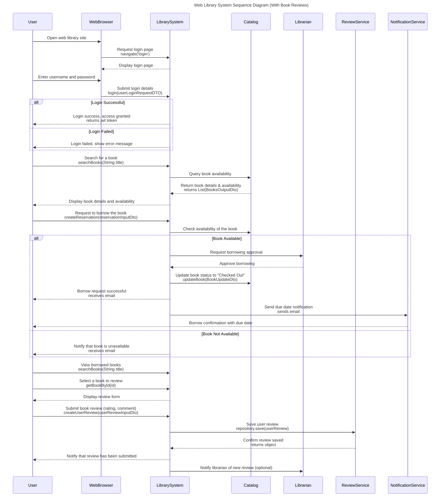

```mermaid
sequenceDiagram
    title Web Library System Sequence Diagram (With Book Reviews)
    
    participant User
    participant WebBrowser
    participant LibrarySystem
    participant Catalog
    participant Librarian
    participant ReviewService
    participant NotificationService
    
    %% 1. User Login
    User->>WebBrowser: Open web library site
    WebBrowser->>LibrarySystem: Request login page <br> navigate('login')
    LibrarySystem-->>WebBrowser: Display login page
    User->>WebBrowser: Enter username and password
    WebBrowser->>LibrarySystem: Submit login details <br> login(userLoginRequestDTO)
    alt Login Successful
        LibrarySystem-->>User: Login success, access granted <br> returns jwt token
    else Login Failed
        LibrarySystem-->>User: Login failed, show error message
    end

    %% 2. Book Search and Borrow
    User->>LibrarySystem: Search for a book <br> searchBooks(String title)
    LibrarySystem->>Catalog: Query book availability
    Catalog-->>LibrarySystem: Return book details & availability <br> returns List(BooksOutputDto)
    LibrarySystem-->>User: Display book details and availability
    User->>LibrarySystem: Request to borrow the book <br> createReservation(reservationInputDto)
    LibrarySystem->>Catalog: Check availability of the book
    alt Book Available
        LibrarySystem->>Librarian: Request borrowing approval
        Librarian-->>LibrarySystem: Approve borrowing
        LibrarySystem->>Catalog: Update book status to "Checked Out" <br> updateBook(BookUpdateDto)
        LibrarySystem-->>User: Borrow request successful <br> receives email
        LibrarySystem->>NotificationService: Send due date notification <br> sends email
        NotificationService-->>User: Borrow confirmation with due date
    else Book Not Available
        LibrarySystem-->>User: Notify that book is unavailable <br> receives email
    end

    %% 3. Book Review Process
    User->>LibrarySystem: View borrowed books <br> searchBooks(String title)
    User->>LibrarySystem: Select a book to review <br> getBookById(id)
    LibrarySystem-->>User: Display review form
    User->>LibrarySystem: Submit book review (rating, comment) <br> createUserReview(userReviewInputDto)
    LibrarySystem->>ReviewService: Save user review <br> repository.save(userReview)
    ReviewService-->>LibrarySystem: Confirm review saved <br> returns object
    LibrarySystem-->>User: Notify that review has been submitted
    LibrarySystem->>Librarian: Notify librarian of new review (optional)

```