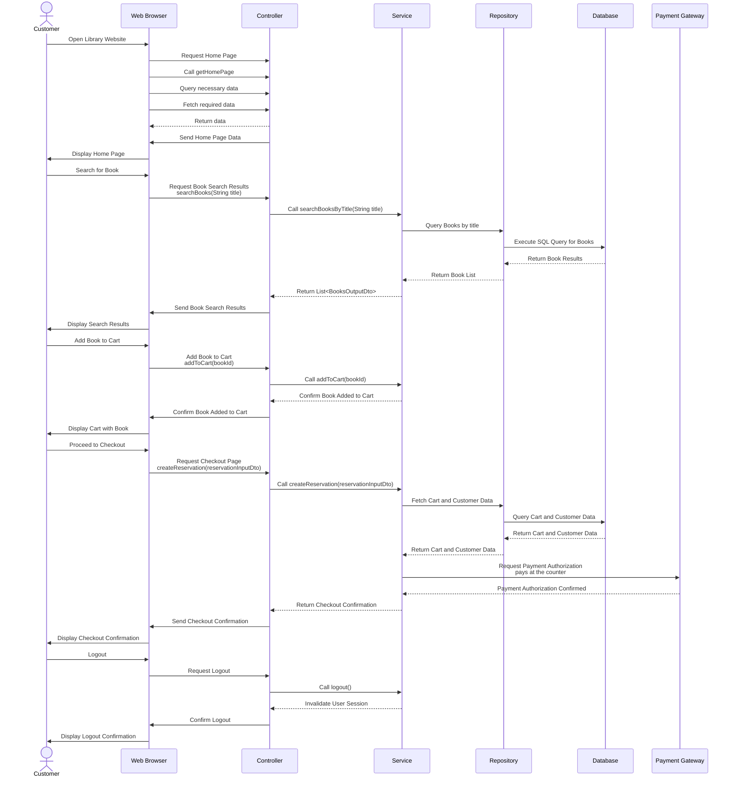

```mermaid
sequenceDiagram
    actor Customer
    participant Web Browser
    participant Controller
    participant Service
    participant Repository
    participant Database
    participant Payment Gateway
    
    %% 1. Customer visits the library website
    Customer ->> Web Browser: Open Library Website
    Web Browser ->> Controller: Request Home Page
    Web Browser ->> Controller: Call getHomePage
    Web Browser ->> Controller: Query necessary data
    Web Browser ->> Controller: Fetch required data
    Controller -->> Web Browser: Return data
    Controller ->> Web Browser: Send Home Page Data
    Web Browser ->> Customer: Display Home Page

    %% 2. Book Search
    Customer ->> Web Browser: Search for Book
    Web Browser ->> Controller: Request Book Search Results <br> searchBooks(String title)
    Controller ->> Service: Call searchBooksByTitle(String title)
    Service ->> Repository: Query Books by title
    Repository ->> Database: Execute SQL Query for Books
    Database -->> Repository: Return Book Results
    Repository -->> Service: Return Book List
    Service -->> Controller: Return List<BooksOutputDto>
    Controller ->> Web Browser: Send Book Search Results
    Web Browser ->> Customer: Display Search Results
    
    %% 3. Add Book to Cart
    Customer ->> Web Browser: Add Book to Cart
    Web Browser ->> Controller: Add Book to Cart <br> addToCart(bookId)
    Controller ->> Service: Call addToCart(bookId)
    Service -->> Controller: Confirm Book Added to Cart
    Controller ->> Web Browser: Confirm Book Added to Cart
    Web Browser ->> Customer: Display Cart with Book
    
    %% 4. Checkout
    Customer ->> Web Browser: Proceed to Checkout 
    Web Browser ->> Controller: Request Checkout Page <br> createReservation(reservationInputDto)
    Controller ->> Service: Call createReservation(reservationInputDto)
    Service ->> Repository: Fetch Cart and Customer Data
    Repository ->> Database: Query Cart and Customer Data
    Database -->> Repository: Return Cart and Customer Data
    Repository -->> Service: Return Cart and Customer Data
    Service ->> Payment Gateway: Request Payment Authorization <br> pays at the counter
    Payment Gateway -->> Service: Payment Authorization Confirmed
    Service -->> Controller: Return Checkout Confirmation
    Controller ->> Web Browser: Send Checkout Confirmation
    Web Browser ->> Customer: Display Checkout Confirmation
    
    %% 5. Logout
    Customer ->> Web Browser: Logout
    Web Browser ->> Controller: Request Logout
    Controller ->> Service: Call logout()
    Service -->> Controller: Invalidate User Session
    Controller ->> Web Browser: Confirm Logout
    Web Browser ->> Customer: Display Logout Confirmation

```