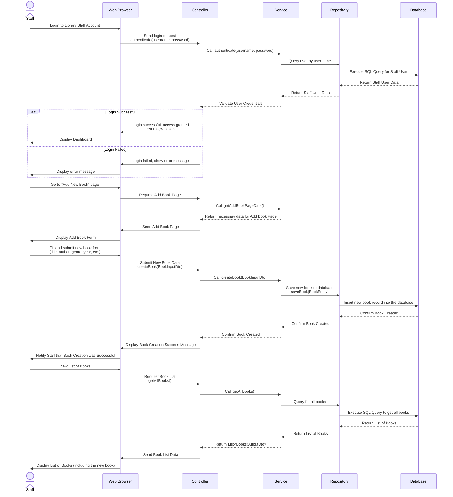

```mermaid
sequenceDiagram
actor Staff
participant Web Browser
participant Controller
participant Service
participant Repository
participant Database

    %% 1. Staff Login
    Staff ->> Web Browser: Login to Library Staff Account
    Web Browser ->> Controller: Send login request <br> authenticate(username, password)
    Controller ->> Service: Call authenticate(username, password)
    Service ->> Repository: Query user by username
    Repository ->> Database: Execute SQL Query for Staff User
    Database -->> Repository: Return Staff User Data
    Repository -->> Service: Return Staff User Data
    Service -->> Controller: Validate User Credentials
    alt Login Successful
        Controller ->> Web Browser: Login successful, access granted <br> returns jwt token
        Web Browser ->> Staff: Display Dashboard
    else Login Failed
        Controller ->> Web Browser: Login failed, show error message
        Web Browser ->> Staff: Display error message
    end
    
    %% 2. Add New Book
    Staff ->> Web Browser: Go to "Add New Book" page
    Web Browser ->> Controller: Request Add Book Page 
    Controller ->> Service: Call getAddBookPageData()
    Service -->> Controller: Return necessary data for Add Book Page
    Controller ->> Web Browser: Send Add Book Page
    Web Browser ->> Staff: Display Add Book Form
    
    %% 3. Staff Fills Out Book Form
    Staff ->> Web Browser: Fill and submit new book form <br> (title, author, genre, year, etc.)
    Web Browser ->> Controller: Submit New Book Data <br> createBook(BookInputDto)
    Controller ->> Service: Call createBook(BookInputDto)
    Service ->> Repository: Save new book to database <br> saveBook(BookEntity)
    Repository ->> Database: Insert new book record into the database
    Database -->> Repository: Confirm Book Created
    Repository -->> Service: Confirm Book Created
    Service -->> Controller: Confirm Book Created
    Controller ->> Web Browser: Display Book Creation Success Message
    Web Browser ->> Staff: Notify Staff that Book Creation was Successful
    
    %% 4. View Created Book
    Staff ->> Web Browser: View List of Books
    Web Browser ->> Controller: Request Book List <br> getAllBooks()
    Controller ->> Service: Call getAllBooks()
    Service ->> Repository: Query for all books
    Repository ->> Database: Execute SQL Query to get all books
    Database -->> Repository: Return List of Books
    Repository -->> Service: Return List of Books
    Service -->> Controller: Return List<BooksOutputDto>
    Controller ->> Web Browser: Send Book List Data
    Web Browser ->> Staff: Display List of Books (including the new book)
```