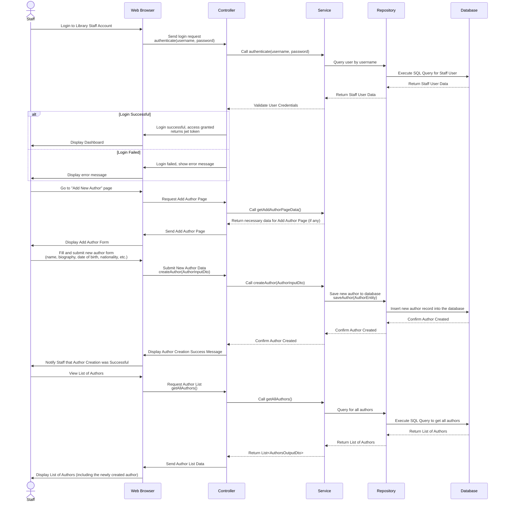

```mermaid
sequenceDiagram
    actor Staff
    participant Web Browser
    participant Controller
    participant Service
    participant Repository
    participant Database
    
    %% 1. Staff Login
    Staff ->> Web Browser: Login to Library Staff Account
    Web Browser ->> Controller: Send login request <br> authenticate(username, password)
    Controller ->> Service: Call authenticate(username, password)
    Service ->> Repository: Query user by username
    Repository ->> Database: Execute SQL Query for Staff User
    Database -->> Repository: Return Staff User Data
    Repository -->> Service: Return Staff User Data
    Service -->> Controller: Validate User Credentials
    alt Login Successful
        Controller ->> Web Browser: Login successful, access granted <br> returns jwt token
        Web Browser ->> Staff: Display Dashboard
    else Login Failed
        Controller ->> Web Browser: Login failed, show error message
        Web Browser ->> Staff: Display error message
    end
    
    %% 2. Access Add Author Page
    Staff ->> Web Browser: Go to "Add New Author" page
    Web Browser ->> Controller: Request Add Author Page
    Controller ->> Service: Call getAddAuthorPageData()
    Service -->> Controller: Return necessary data for Add Author Page (if any)
    Controller ->> Web Browser: Send Add Author Page
    Web Browser ->> Staff: Display Add Author Form
    
    %% 3. Staff Fills Out Author Form
    Staff ->> Web Browser: Fill and submit new author form <br> (name, biography, date of birth, nationality, etc.)
    Web Browser ->> Controller: Submit New Author Data <br> createAuthor(AuthorInputDto)
    Controller ->> Service: Call createAuthor(AuthorInputDto)
    Service ->> Repository: Save new author to database <br> saveAuthor(AuthorEntity)
    Repository ->> Database: Insert new author record into the database
    Database -->> Repository: Confirm Author Created
    Repository -->> Service: Confirm Author Created
    Service -->> Controller: Confirm Author Created
    Controller ->> Web Browser: Display Author Creation Success Message
    Web Browser ->> Staff: Notify Staff that Author Creation was Successful
    
    %% 4. View Created Author
    Staff ->> Web Browser: View List of Authors
    Web Browser ->> Controller: Request Author List <br> getAllAuthors()
    Controller ->> Service: Call getAllAuthors()
    Service ->> Repository: Query for all authors
    Repository ->> Database: Execute SQL Query to get all authors
    Database -->> Repository: Return List of Authors
    Repository -->> Service: Return List of Authors
    Service -->> Controller: Return List<AuthorsOutputDto>
    Controller ->> Web Browser: Send Author List Data
    Web Browser ->> Staff: Display List of Authors (including the newly created author)

```