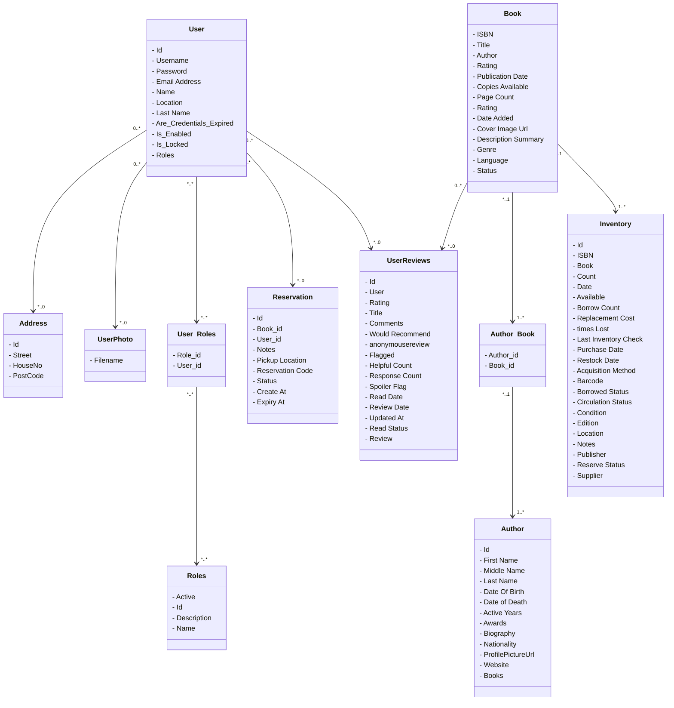

```mermaid
    classDiagram        
    
    User "0..*" --> "*..0" Address
    User "0..*" --> "*..0" UserPhoto
    User "*..*"--> "*..*" User_Roles
    User_Roles "*..*"--> "*..*" Roles
    User "0..*" --> "*..0" Reservation
    User "0..*" --> "*..0" UserReviews
    Book "0..*" --> "*..0" UserReviews
    
    Book "*..1" --> "1..*" Author_Book
    Author_Book "*..1" --> "1..*" Author
    Book "*..1" --> "1..*" Inventory
    
    class Book {
        - ISBN
        - Title
        - Author
        - Rating
        - Publication Date
        - Copies Available
        - Page Count
        - Rating
        - Date Added
        - Cover Image Url
        - Description Summary
        - Genre
        - Language
        - Status
    }
    
    class Author {
        - Id
        - First Name
        - Middle Name
        - Last Name
        - Date Of Birth 
        - Date of Death
        - Active Years
        - Awards
        - Biography
        - Nationality
        - ProfilePictureUrl
        - Website
        
        - Books
    }
    
    class Inventory {
        - Id
        - ISBN
        - Book
        - Count
        - Date
        - Available
        - Borrow Count
        - Replacement Cost
        - times Lost
        - Last Inventory Check
        - Purchase Date
        - Restock Date
        - Acquisition Method
        - Barcode
        - Borrowed Status
        - Circulation Status
        - Condition
        - Edition
        - Location
        - Notes
        - Publisher
        - Reserve Status
        - Supplier
    }
    
    class User {
        - Id
        - Username
        - Password
        - Email Address
        - Name
        - Location
        - Last Name
        - Are_Credentials_Expired
        - Is_Enabled
        - Is_Locked
        
        - Roles
    }
    
    class Roles {
        - Active 
        - Id
        - Description
        - Name
    }
    
    class User_Roles {
        - Role_id
        - User_id
    }
    
    class Author_Book {
        - Author_id
        - Book_id
    }
    
    class UserReviews {
        - Id
        - User
        - Rating
        - Title
        - Comments
        - Would Recommend
        - anonymousereview
        - Flagged
        - Helpful Count
        - Response Count
        - Spoiler Flag
        - Read Date
        - Review Date
        - Updated At
        - Read Status
        - Review
    }
    
    class Reservation {
        - Id
        - Book_id
        - User_id
        - Notes
        - Pickup Location
        - Reservation Code
        - Status
        - Create At
        - Expiry At
    }
    
    class Address {
        - Id
        - Street
        - HouseNo
        - PostCode
    }
    
    class UserPhoto {
        - Filename
    }
 
```