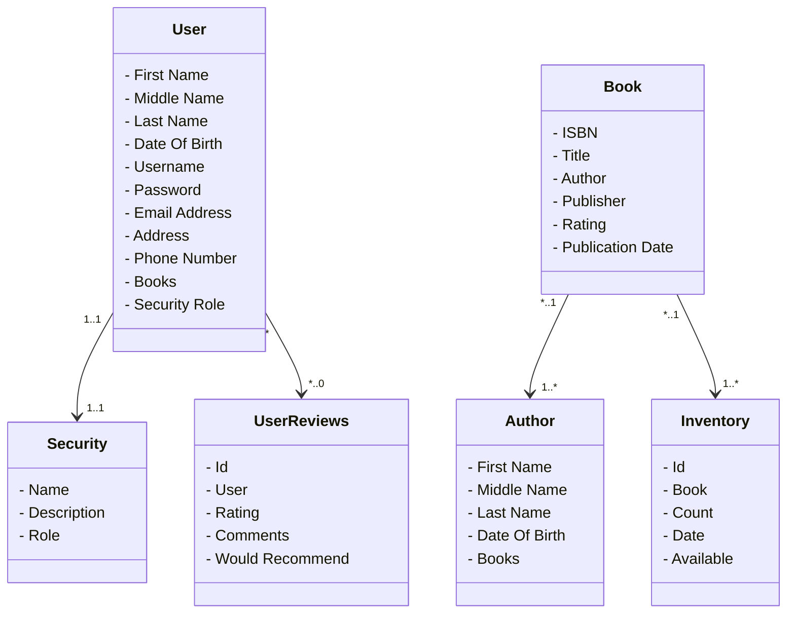

```mermaid
    classDiagram        
    
    User "1..1"--> "1..1" Security
    User "0..*"--> "*..0" User Reviews
    Book "*..1" --> "1..*" Author
    Book "*..1" --> "1..*" Inventory
    
    class Book {
        - ISBN
        - Title
        - Author
        - Publisher
        - Rating
        - Publication Date
    }
    
    class Author {
        - First Name
        - Middle Name
        - Last Name
        - Date Of Birth 
        
        - Books
    }
    
    class Inventory {
        - Id
        - Book
        - Count
        - Date
        - Available
    }
    
    class User {
        - First Name
        - Middle Name
        - Last Name
        - Date Of Birth
        - Username
        - Password
        - Email Address
        - Address
        - Phone Number
        
        - Books
        - Security Role
    }
    
    class Security {
        - Name
        - Description
        - Role
    }
    
    class UserReviews {
        - Id
        - User
        - Rating
        - Comments
        - Would Recommend
 }
 
```